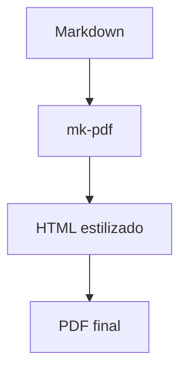

# Guia de Exemplo — mk-pdf

Este documento de teste cobre todos os recursos suportados pelo `mk-pdf`: sumário
automático, realce de sintaxe, imagem local, tabela e diagrama Mermaid.

## Introdução

Bem-vindo! Este é um parágrafo de exemplo com **negrito**, _itálico_ e um [link](https://github.com).

Abaixo está uma imagem local referenciada por caminho relativo:


## Bloco de código

Exemplo de JavaScript com realce de sintaxe:

```javascript
function soma(a, b) {
  return a + b;
}

console.log(soma(2, 3));
```

Exemplo de Python:

```python
def saudacao(nome):
    return f"Olá, {nome}!"

print(saudacao("mundo"))
```

## Tabela

| Recurso            | Suportado |
|--------------------|-----------|
| Sumário automático | ✅        |
| Realce de sintaxe  | ✅        |
| Imagens locais     | ✅        |
| Diagramas Mermaid  | ✅        |
| Numeração de página| ✅        |

## Diagrama Mermaid



## Conclusão

Se este PDF foi gerado com sumário no topo, numeração de páginas no rodapé,
a imagem, a tabela e o diagrama acima renderizados corretamente, a ferramenta
está funcionando como esperado.
